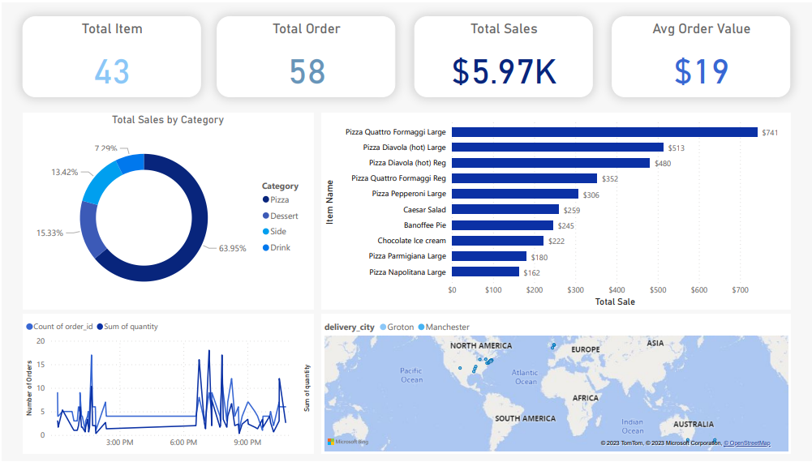
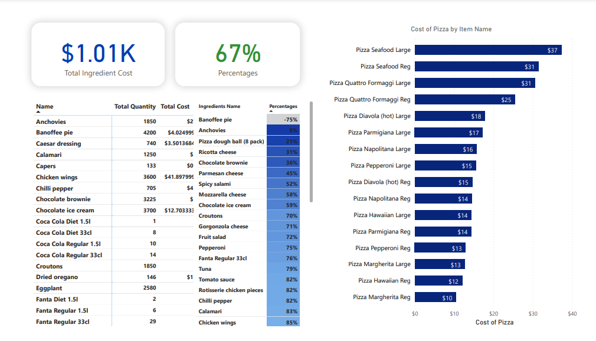
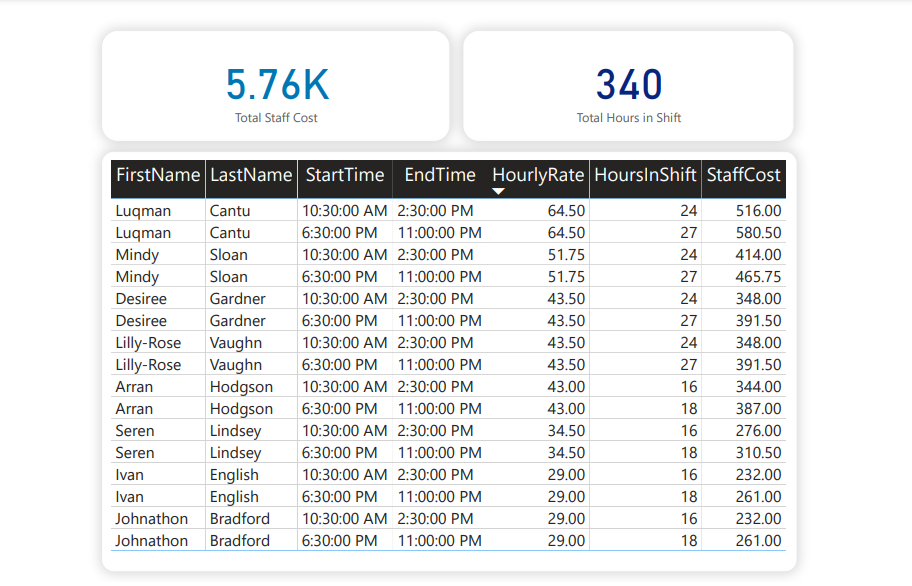

# Integrated Pizza Shop Management System: Sales Analysis, Inventory Control, and Staff Monitoring

## Objectives

Stock Control Requirements
Our client, a pizza shop, wants to implement a stock control system to efficiently manage their inventory and ensure timely reordering of ingredients. To fulfill this requirement, we need to gather the following information:

- Ingredients for Each Pizza: Identify the list of ingredients required for each type of pizza offered by the shop. This includes toppings, sauces, dough, cheese, and any other components specific to each pizza.

- Quantity Based on Pizza Size: Determine the quantity of each ingredient needed for different pizza sizes. For example, a small pizza may require fewer toppings compared to a large pizza. Define the ingredient quantities for each size option.

- Existing Stock Level: Determine the current stock levels of each ingredient. This includes tracking the quantity of each ingredient available in the shop's inventory.

By considering these factors, we can develop a stock control system that will notify the pizza shop when it's time to reorder specific ingredients based on their consumption rates, taking into account the lead time required for supplier deliveries.

Implementing an effective stock control system will help the pizza shop maintain optimal inventory levels, minimize the risk of running out of ingredients, and ensure smooth operations.


### SQL Query

#### Query-1
The inner query (subquery) retrieves data from multiple tables (orders, item, recipe, and ingredient) and performs joins based on their respective relationships. It groups the data by specific columns and calculates the sum of the quantity column from the orders table.

The outer query selects specific columns from the result of the inner query and performs additional calculations to derive metrics related to ingredients and their costs. These calculations include:
* ordered_weight: Multiplies the order_quantity and recipe_quantity columns.
* unit_cost: Divides the ing_price by the ing_weight.
* ingredient_cost: Multiplies the ordered_weight by the unit_cost.

The final result of the query includes columns such as *item_name, ing_name, ing_id, ing_weight, ing_price, order_quantity, recipe_quantity, ordered_weight, unit_cost, and ingredient_cost.*
```sql
SELECT
    s1.item_name AS item_name,
    s1.ing_name AS ing_name,
    s1.ing_id AS ing_id,
    s1.ing_weight AS ing_weight,
    s1.ing_price AS ing_price,
    s1.order_quantity AS order_quantity,
    s1.recipe_quantity AS recipe_quantity,
    (s1.order_quantity * s1.recipe_quantity) AS ordered_weight,
    (s1.ing_price / s1.ing_weight) AS unit_cost,
    ((s1.order_quantity * s1.recipe_quantity) * (s1.ing_price / s1.ing_weight)) AS ingredient_cost 
FROM
    (
    SELECT
        o.item_id AS item_id,
        i.sku AS sku,
        i.item_name AS item_name,
        r.ing_id AS ing_id,
        ing.ing_name AS ing_name,
        ing.ing_weight AS ing_weight,
        ing.ing_price AS ing_price,
        SUM(o.quantity) AS order_quantity,
        r.quantity AS recipe_quantity 
    FROM
        (((orders o
        LEFT JOIN item i ON (o.item_id = i.item_id))
        LEFT JOIN recipe r ON (i.sku = r.recipe_id))
        LEFT JOIN ingredient ing ON (ing.ing_id = r.ing_id))
    GROUP BY
        o.item_id,
        i.sku,
        i.item_name,
        r.ing_id,
        r.quantity,
        ing.ing_name,
        ing.ing_weight,
        ing.ing_price
    ) s1

```

#### Query 2

This SQL query retrieves data from the orders and item tables, performing a left join based on the item_id column. It calculates the total sales for each item by multiplying the item price with the sum of the quantity for that item in the orders.

The result set includes columns such as item_id, sku, item_cat, item_price, order_quantity, and total_sales. The GROUP BY clause groups the data by item_id, sku, item_cat, and item_price to aggregate the quantities and calculate the total sales per item.

By using this query, we can obtain a dataset that provides information about the item, its category, price, order quantity, and total sales generated by each item.

```sql
SELECT
    o.item_id AS item_id,
    i.sku AS sku,
    i.item_cat AS item_cat,
    i.item_price AS item_price,
    SUM(o.quantity) AS order_quantity,
    i.item_price * SUM(o.quantity) AS total_sales
FROM
    orders o
    LEFT JOIN item i ON o.item_id = i.item_id
GROUP BY
    o.item_id,
    i.sku,
    i.item_cat,
    i.item_price

```

### Query 3

This SQL query retrieves data from multiple tables (stock1, inventory, and ingredient) and performs left joins based on their respective relationships.

The inner query (subquery) s2 calculates the sum of ordered_weight grouped by ing_name and ing_id from the stock1 table.

The outer query selects specific columns from the result of the inner query and performs additional calculations. It retrieves columns like ing_name, ordered_weight, ing_weight, quantity, and calculates total_inv_weight as the product of ing_weight and quantity. It also calculates remaining_weight by subtracting ordered_weight from total_inv_weight.

The joins are performed to connect the inventory and ingredient tables based on their respective IDs (item_id and ing_id).

```sql
SELECT
    s2.ing_name,
    s2.ordered_weight,
    ing.ing_weight,
    inv.quantity,
    ing.ing_weight * inv.quantity AS total_inv_weight,
    (ing.ing_weight * inv.quantity) - s2.ordered_weight AS remaining_weight
FROM
    (
    SELECT
        ing_id,
        ing_name,
        SUM(ordered_weight) AS ordered_weight
    FROM
        stock1
    GROUP BY
        ing_name,
        ing_id
    ) s2
    LEFT JOIN inventory inv ON inv.item_id = s2.ing_id
    LEFT JOIN ingredient ing ON ing.ing_id = s2.ing_id

```

#### Query 4

This SQL query retrieves data from multiple tables (rota, staff, and shift) and performs left joins based on their respective relationships.

The selected columns include date, first_name, last_name, hourly_rate, start_time, and end_time. The query also calculates the hours_in_shift by subtracting the start time from the end time in minutes and then converting it to hours. Additionally, the staff_cost is calculated by multiplying the hours_in_shift by the hourly_rate of the staff member.

```sql
SELECT
    r.date,
    s.first_name,
    s.last_name,
    s.hourly_rate,
    sh.start_time,
    sh.end_time,
    ((DATEDIFF(hour, sh.start_time, sh.end_time) * 60 + DATEDIFF(minute, sh.start_time, sh.end_time))) / 60 AS hours_in_shift,
    ((DATEDIFF(hour, sh.start_time, sh.end_time) * 60 + DATEDIFF(minute, sh.start_time, sh.end_time))) / 60 * s.hourly_rate AS staff_cost
FROM
    rota r
    LEFT JOIN staff s ON r.staff_id = s.staff_id
    LEFT JOIN shift sh ON r.shift_id = sh.shift_id;

```

## PowerBi Report

### Dashboard 1 - Order Activity

To fulfill the requirements for the Order Activity dashboard, we will create a visual representation of the following data:

- Total Orders: Display the total number of orders placed within a specific time period. This provides an overview of the order volume.

- Total Sales: Show the total sales generated from all the orders placed within a specific time period. This metric helps assess the overall revenue.

- Total Items: Present the total count of items sold across all orders. This provides insights into the volume of products sold.

- Average Order Value: Calculate the average value of each order by dividing the total sales by the total number of orders. This metric helps understand the typical spending of customers.

- Sales by Category: Visualize the sales distribution across different categories of items. This allows identification of popular categories and their contribution to overall sales.

- Top Selling Items: Display the top-selling items based on the quantity sold or revenue generated. This helps identify the most popular and profitable products.

- Orders by Hour: Present a chart or graph showing the distribution of orders by hour throughout the day. This highlights peak ordering periods or any notable trends.

- Sales by Hour: Show the sales volume or revenue generated for each hour of the day. This provides insights into the sales patterns throughout the day.

- Orders by Address: Display a map or table visualizing the distribution of orders by address or geographical location. This helps identify areas with high order activity or customer density.

### Outcome
- *By incorporating these visualizations into the Order Activity dashboard, the pizza shop can gain valuable insights into their order volume, sales performance, popular items, and customer behavior. These insights can inform decision-making processes and assist in improving operational efficiency and customer satisfaction.*




### Dashboard 2 - Inventory Management

To meet the requirements for the Inventory Management dashboard, we will develop visualizations that provide the following data:

- Total Quantity by Ingredient: Display the total quantity of each ingredient in the inventory. This helps monitor the availability of ingredients and identify any shortages or excesses.

- Total Cost of Ingredients: Show the total cost of all the ingredients in the inventory. This metric provides an overview of the investment tied up in the inventory.

- Calculated Cost of Pizza: Calculate the cost of making each pizza based on the cost of the ingredients used. This metric helps monitor the profitability of each pizza and identify pricing strategies.

- Percentage Stock Remaining by Ingredient: Visualize the percentage of stock remaining for each ingredient in the inventory. This allows quick identification of ingredients that are running low and need to be reordered

### Outcome
- *By incorporating these visualizations into the Inventory Management dashboard, the pizza shop can efficiently manage their inventory levels, monitor ingredient costs, and ensure the availability of ingredients for pizza production. These insights can help optimize inventory management, control costs, and maximize profitability.*



### Dashboard 3 - Staff Management

To fulfill the requirements for the Staff Management dashboard, we will create visualizations that provide the following data:

- Total Staff Cost: Display the total cost of staff wages or salaries for a given period. This metric provides an overview of the overall labor expenses.

- Total Hours Worked: Show the total number of hours worked by all staff members for a given period. This provides insights into the overall staff workload.

- Hours Worked by Staff Member: Visualize the hours worked by each staff member for a given period. This allows monitoring of individual staff members' contributions and helps identify any imbalances or discrepancies.

- Cost per Staff Member: Display the cost incurred for each staff member individually. This metric helps assess the cost-effectiveness of each staff member and identify areas for potential improvement.

### Outcome
*By incorporating these visualizations into the Staff Management dashboard, the pizza shop can monitor staff costs, analyze labor efficiency, and ensure proper allocation of resources. These insights can contribute to effective staff management, optimize scheduling, and support decision-making processes related to staffing and cost control.*



[Report](SQL_PROJECTS.pdf)
